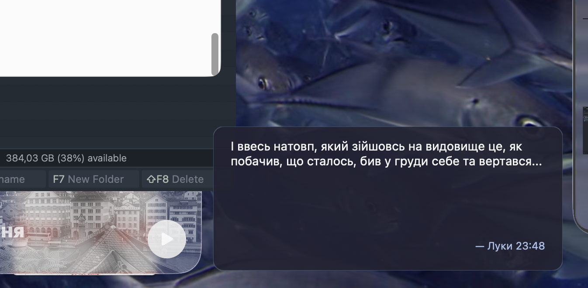

# BibleVerse.spoon

Hammerspoon Spoon that displays random New Testament verses as a desktop widget.



## Installation

1. Download or clone this repository
2. Copy to `~/.hammerspoon/Spoons/BibleVerse.spoon/`
3. Add to `~/.hammerspoon/init.lua`:

```lua
hs.loadSpoon("BibleVerse")
spoon.BibleVerse:start()
```

## Configuration

### Single Monitor

```lua
hs.loadSpoon("BibleVerse")
spoon.BibleVerse.config.translation = "KJV"
spoon.BibleVerse.config.position.default = { x = -420, y = -180 }
spoon.BibleVerse:start()
```

### Multi-Monitor

```lua
hs.loadSpoon("BibleVerse")
spoon.BibleVerse.config.translation = "UBIO"
spoon.BibleVerse.config.position.default = { x = -420, y = -180 }
spoon.BibleVerse.config.position["Built-in Retina Display"] = { x = -420, y = -200 }
spoon.BibleVerse.config.position["DELL U2723QE"] = { x = -450, y = -180 }
spoon.BibleVerse:start()
```

Position uses negative values for offset from right/bottom edge. Use `hs.screen.allScreens()` in Hammerspoon console to find your monitor names.

### All Options

```lua
hs.loadSpoon("BibleVerse")
spoon.BibleVerse.config.translation = "KJV"           -- "UBIO" (Ukrainian) or "KJV" (English)
spoon.BibleVerse.config.refresh_interval = 1800       -- seconds
spoon.BibleVerse.config.width = 450
spoon.BibleVerse.config.height = 180
spoon.BibleVerse.config.background.color = { red = 0.2, green = 0.1, blue = 0.1 }
spoon.BibleVerse.config.background.alpha = 0.85
spoon.BibleVerse.config.background.corner_radius = 12
spoon.BibleVerse.config.font.name = "Georgia"
spoon.BibleVerse.config.font.size = 16
spoon.BibleVerse.config.font.color = { white = 1.0 }
spoon.BibleVerse.config.font.reference_size = 12
spoon.BibleVerse.config.font.reference_color = { red = 0.6, green = 0.7, blue = 0.9 }
spoon.BibleVerse:start()
```

## Hotkey

```lua
hs.hotkey.bind({"cmd", "alt"}, "B", function()
    spoon.BibleVerse:refresh()
end)
```

## Usage

Click the widget to open the verse in your browser.

## API

- `spoon.BibleVerse:start()` — Start widget with timer and wake watcher
- `spoon.BibleVerse:stop()` — Stop and remove widget
- `spoon.BibleVerse:refresh()` — Fetch and display new verse

## License

MIT
